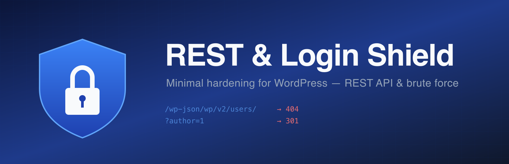

# REST & Login Shield

Minimal WordPress security plugin that blocks REST API user enumeration, hides server metadata, and protects `wp-login.php` against brute force attacks.



## What it does

| Protection | Effect |
|---|---|
| REST API user enumeration | `/wp-json/wp/v2/users/` returns 404 for unauthenticated requests |
| REST API metadata | Strips `description`, `gmt_offset`, `timezone_string` from `/wp-json/` |
| Author enumeration | `?author=N` is redirected (301) to the home page |
| Brute force protection | Configurable IP lockout after N failed logins, with CIDR whitelist |

Each protection can be toggled independently in **Settings → REST & Login Shield**.

## Installation

### Manual (single site)

1. Download the latest [release ZIP](https://github.com/weblixpl/rest-login-shield/releases).
2. WordPress admin → **Plugins → Add New → Upload Plugin** → choose the ZIP → **Install & Activate**.
3. Configure under **Settings → REST & Login Shield**.

### Bulk deployment (WP Toolkit / cPanel / Plesk)

1. Upload the ZIP to WP Toolkit's plugin library.
2. Select multiple sites → **Install plugin** → **REST & Login Shield**.
3. Defaults are safe (all four protections enabled, 5 attempts / 30 min lockout) — no per-site configuration needed unless you want to add IP whitelists.

## Automatic updates

The plugin uses [plugin-update-checker](https://github.com/YahnisElsts/plugin-update-checker) to receive updates from GitHub releases. When a new version is tagged, every installation will show an update notification in the WordPress admin within 12 hours — identical UX to plugins from wordpress.org.

### Releasing a new version (maintainer workflow)

```bash
# Bump version in rest-login-shield.php and readme.txt
git commit -am "Release vX.Y.Z"
git tag vX.Y.Z
git push && git push --tags
# On GitHub, create a Release from the tag (optional, but recommended for release notes)
```

## Settings

- **Enable/disable** each protection independently
- **Max failed attempts** (1–50)
- **Lockout duration** in minutes (1–1440)
- **IP whitelist** — one entry per line, supports IPv4, IPv6, and CIDR (e.g. `192.168.1.0/24`). Lines starting with `#` are treated as comments.
- **Currently blocked IPs** — table with one-click unblock
- **Recent failed attempts** — log of last 50 failed logins

## Requirements

- WordPress 5.8+
- PHP 7.4+

## Languages

English (default), Polish, Danish, German, Czech, Slovak, French.

## License

GPL-2.0-or-later
